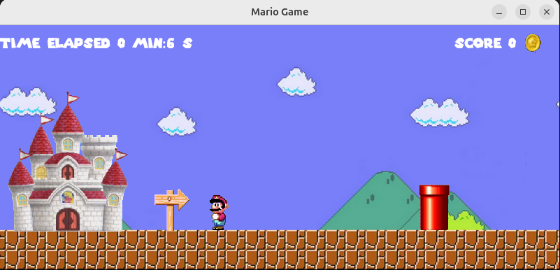
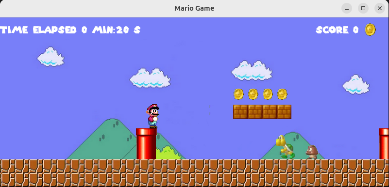
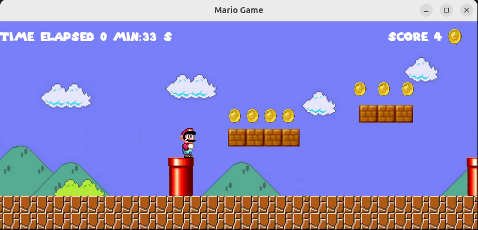

# Mario JavaFX Game

Welcome to the **Mario JavaFX Game**!  
This is a simple Mario-style platformer built with Java 11 and JavaFX.  
Enjoy classic gameplay, collect coins, avoid enemies, and reach the flag!

---

## 🎮 Features

- Classic Mario platformer mechanics
- Smooth character movement and jumping
- Enemies: Champignons (mushrooms) and Turtles
- Collectible coins with animated sprites
- Score and timer display
- Level restart and game over transitions
- Responsive controls (keyboard)
- Custom pixel-art graphics

---

## 🖼️ Screenshots

|  |  |  |
|:--:|:--:|:--:|

---

## 🚀 Getting Started

### Prerequisites

- Java 11+
- Maven

### Build & Run

```sh
mvn clean javafx:run
```

The game window will open. Use your keyboard to play!

---

## 🎹 Controls

- **Numpad 6**: Move Right
- **Numpad 4**: Move Left
- **Space**: Jump

---

## 📁 Project Structure

- `src/main/java/com/game/mario/` — Main game logic and classes
- `src/main/resources/com/game/mario/` — FXML layouts and resources
- `screenshot/` — Game screenshots

---

## 🛠️ Technologies

- Java 11
- JavaFX 13
- Maven

---

## 📜 License

This project is for educational purposes.

---

Enjoy playing!  
Feel free to contribute or suggest improvements.